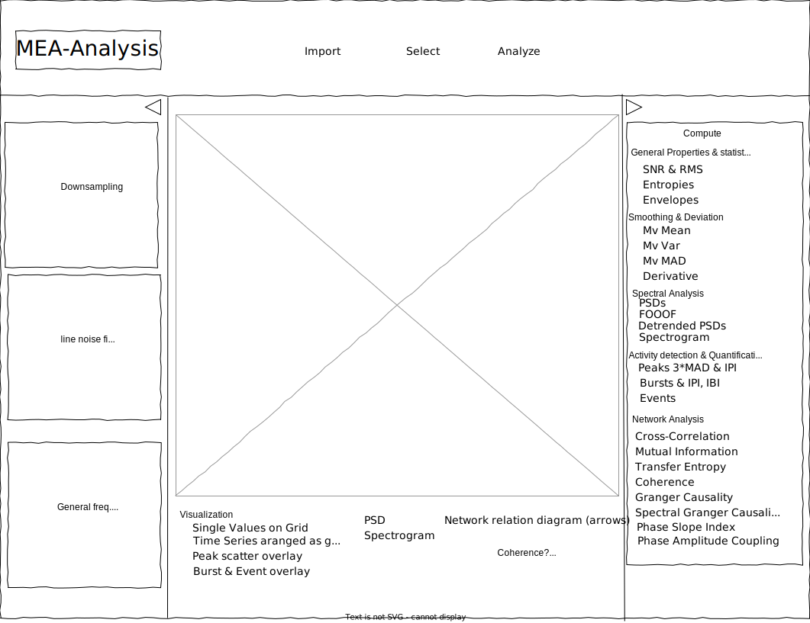

# Multi-Electrode Array Analysis

## Installation
Using pip:  
```  
python -m venv mea-venv
source mea-venv/bin/activate
pip install -r requirements.txt  
```  

## Running  
If the virtual environment is not already active run
```
source mea-venv/bin/activate
```
Then:
```  
cd src && python -m webapp  
```  
Finally, visit [127.0.0.1:8080](127.0.0.1:8080) with your browser
## Updating
```
git fetch && git pull
```

# Wireframe of GUI

